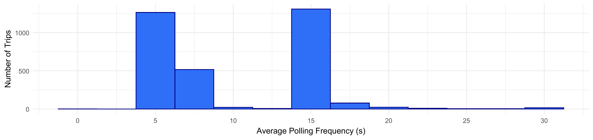

```{r, include = FALSE}
knitr::opts_chunk$set(
  collapse = TRUE,
  comment = "#>"
)
```

# Introduction

This vignette contains all code use to clean and visualize the AVL data presented in our Journal of Public Transportation paper. This demonstrates the application of the workflow and provides a rough estimate of the package's efficiency by tracking the computation time of each step. We ran this code on a typical consumer laptop (HP Spectre x360, with a 14-core 12th-gen Core i7-12700H and 16 GB of RAM).

This vignette is intended to complement our paper. Check out the full paper or the [package website](https://utel-uiuc.github.io/transittraj/articles/data-workflow-la.html) for a more thorough discussion of these cleaning steps.

# Data

The data we used here was shared with us privately by IndyGo
via their Swiftly API endpoint. As such, we unfortunately cannot share the
raw data. We've pre-loaded the following IndyGo data into our RStudio
workspace before running this vignette:

  - `avl_df`: The TIDES-compliant `vehicle_locations.csv` table of historic AVL data. This includes all northbound Red Line (90N) trips made on weekdays in September and November 2024.

  - `route_geom`: The Red Line's northbound alignment, as retrieved from IndyGo's GTFS via `transittraj::get_shape_geometry()`.

With this, we can load the packages we'll need:

```{r setup, message = FALSE, warning = FALSE}
# For analysis
library(transittraj)
library(tidyverse)

# For plotting
library(marquee)
library(patchwork)
```

Next, we'll set some parameters for our visualizations:

``` {r}
# colors
my_r <- "#f43155"
my_b <- "#2f6ff8"
my_g <- "#00A884"

# marquee
code_style <- classic_style(code_font = "Consolas") %>%
  modify_style(tag = "code",
               background = "#e8f7ff",
               color = "#0a0738"
  )
marquee_label <- function(border = "firebrick") {
  
  lab <- classic_style(
    margin = trbl(0),
    padding = trbl(4),
    border = border,
    border_width = trbl(1),
    border_radius = 3,
    align = "center"
  )
  return(lab)
}
```

And we can set the parameters we'll use for our data cleaning. Throughout the cleaning process, we'll reference these names variables, rather than using numeric values.

``` {r}
# - Cleaning parameters -
indy_crs <- 32616 # WGS 84 UTM Zone 16N
route_buffer = 50 # meters
min_dist = 200 # meters
min_dur = 90 # seconds
dist_error = 0.001 # meters
max_d_gap = 800 # meters
hampel_t = 3
```

``` {r, echo = FALSE}
# Load raw data -- saved to private OneDrive
avl_df <- readRDS("C:\\Users\\obrie\\OneDrive - University of Illinois - Urbana\\IndyGo Project\\Analysis_new\\avl_data\\rt90\\precleaned\\avl_90N_2024_10to12_df.rds") %>%
# avl_df <- readRDS("C:\\Users\\obrie\\OneDrive - University of Illinois - Urbana\\IndyGo Project\\Analysis_new\\avl_data\\rt90\\precleaned\\avl_90N_2024_07to09_df.rds") %>%
  filter(month(event_timestamp) %in% c(11, 12)) %>%
  # filter(month(event_timestamp) %in% c(9)) %>%
  mutate(operator_id = as.character(operator_id),
         location_ping_id = as.character(location_ping_id))
route_geom <- readRDS("C:\\Users\\obrie\\OneDrive - University of Illinois - Urbana\\IndyGo Project\\Analysis_new\\spatial\\routes\\route_geom_90N.rds")
stops <- readRDS("C:\\Users\\obrie\\OneDrive - University of Illinois - Urbana\\IndyGo Project\\Analysis_new\\spatial\\routes\\stop_distances.rds") %>%
  filter(route == "90N") %>%
  select(-route) %>%
  mutate(stop_name = str_remove_all(stop_name,
                                    pattern = " Station NB"))
signals <- readRDS("C:\\Users\\obrie\\OneDrive - University of Illinois - Urbana\\IndyGo Project\\Analysis_new\\spatial\\signals\\signals_90N.rds") %>%
  filter(grepl("90N", routes)) %>%
  select(name, distance, routes)
signal_boundings <- readRDS("C:\\Users\\obrie\\OneDrive - University of Illinois - Urbana\\IndyGo Project\\Analysis_new\\spatial\\signals\\intersection_bounding_90N.rds") %>%
  select(-time)
```

We'll begin by quickly exploring the average polling frequencies by each trip. Below we calculate the after polling frequency by trip, then plot a histogram of the trip-wide average frequencies.

``` {r}
# Get initial dims
n_obs <- dim(avl_df)[1]
n_trips <- length(unique(avl_df$trip_id_performed))

# Polling
bin_width <- 2.5 # sec
bin_cap <- 30 # sec
polling <- avl_df %>%
  group_by(trip_id_performed) %>%
  summarize(t_0 = min(event_timestamp),
            t_f = max(event_timestamp),
            n_obs = n()) %>%
  mutate(dur = as.numeric(difftime(t_f, t_0, units = "secs")),
         avg_freq = dur / n_obs,
         freq_capped = if_else(condition = avg_freq >= bin_cap,
                               true = bin_cap,
                               false = avg_freq))
```

``` {r, eval = FALSE}
# Plot polling frequencies
polling_hist <- ggplot(data = polling) +
  geom_histogram(aes(x = freq_capped),
                 fill = my_b, color = "navy",
                 binwidth = bin_width) +
  theme_minimal() +
  scale_x_continuous(breaks = seq(from = 0, to = bin_cap, by = 5),
                     labels = seq(from = 0, to = bin_cap, by = 5)) +
  labs(x = "Average Polling Frequency (s)",
       y = "Number of Trips")
polling_hist
```

``` {r, echo = FALSE, eval = FALSE}
ggsave(plot = polling_hist,
       height = 45, width = 190, units = "mm",
       scale = 1.5, fallback_resolution = 1000,
       filename = "C:\\Users\\obrie\\OneDrive - University of Illinois - Urbana\\IndyGo Project\\Deliverables\\Papers\\JPT\\images\\figure_5.pdf", device = cairo_pdf)

suppressWarnings(
  pdftools::pdf_convert(
    pdf = "C:\\Users\\obrie\\OneDrive - University of Illinois - Urbana\\IndyGo Project\\Deliverables\\Papers\\JPT\\images\\figure_5.pdf",
    filenames = "figures/figure_5.png",
    format = "png", dpi = 500
  )
)
```

``` {r, echo = FALSE, eval = TRUE, out.width = "100%", fig.cap = ""}

```

# Proposed Workflow

The following sub-sections present each step of the proposed workflow. These steps are more thoroughly described in our paper and on the [package website](https://utel-uiuc.github.io/transittraj/articles/data-workflow-la.html). At each step, we record the number of points and trips removed and the processing time required. Finally, we show the code used to generate each example visualization found in the paper.

## Steps 1 & 2: Buffer & Project onto Route

Steps 1 and 2 share the same function, `get_linear_distances()`, as they both require geospatial analysis. We'll begin by running these steps:

```{r step12}
# - Step 1 & 2: Buffer & Linearize -
t_0 <- Sys.time()
distance_df <- get_linear_distances(avl_df = avl_df,
                                    shape_geometry = route_geom,
                                    clip_buffer = route_buffer,
                                    project_crs = indy_crs) %>%
  filter(distance < 20500)
t_f <- Sys.time()

# Save changes
dur <- c(NA,
         as.numeric(difftime(t_f, t_0, units = "secs")))
n_obs <- append(n_obs,
                dim(distance_df)[1])
n_trips <- append(n_trips,
                  length(unique(distance_df$trip_id_performed)))

rm(avl_df)
```

## Step 3: Remove Overlapping Subtrips

First, run the step:

``` {r step3}
# - Step 3: Remove Overlap Subtrips -
t_0 <- Sys.time()
step3_df <- clean_overlapping_subtrips(distance_df = distance_df,
                                       check_operator = TRUE,
                                       return_removals = FALSE)
t_f <- Sys.time()

# Save changes
dur <- append(dur,
              as.numeric(difftime(t_f, t_0, units = "secs")))
n_obs <- append(n_obs,
                dim(step3_df)[1])
n_trips <- append(n_trips,
                  length(unique(step3_df$trip_id_performed)))
```

Next, plot our example:

``` {r, eval = FALSE}
plot_trip <- "2024-09-12-t3B2-b232A-sl3-N"
plot_df <- distance_df %>%
  filter(trip_id_performed == plot_trip) %>%
  mutate(subtrip_id = paste(trip_id_performed, operator_id, vehicle_id,
                            sep = "-"),
         op_veh = paste(operator_id, vehicle_id, sep = ", "))

step3_plot <- ggplot(data = plot_df) +
  geom_hline(data = stops,
             aes(yintercept = distance, linetype = "BRT Stops"),
             color = "grey40", linewidth = 0.4) +
  geom_line(aes(x = event_timestamp, y = distance, color = op_veh),
            linewidth = 2, alpha = 0.6) +
  geom_point(aes(x = event_timestamp, y = distance, color = op_veh),
            size = 0.8, alpha = 1) +
  scale_color_manual(name = "Operator,\nVehicle ID",
                     values = c("10342, 1981" = "#f43155",
                                "2339, 2393" = "#2f6ff8")) +
  scale_linetype_manual(name = "Features",
                        values = c("BRT Stops" = "dashed")) +
  ylim(c(0, 12500)) +
  xlim(c(as.POSIXct("2024-09-12 09:45:00", tz = "America/New_York"),
         as.POSIXct("2024-09-12 10:23:00", tz = "America/New_York"))) +
  theme_minimal() +
  labs(x = "Time (morning of 9/12/24)",
       y = "Distance from Beginning(m)",
       title = "(B) Sub-Trips in AVL: `clean_overlapping_subtrips()`",
       subtitle = paste("IndyGo Red Line 90 NB; Trip ID ", plot_trip,
                        sep = "")) +
  theme(plot.title = element_marquee(style = code_style),
        plot.title.position = "plot")
step3_plot
```

``` {r, echo = FALSE, eval = FALSE}
ggsave(plot = step3_plot,
       height = 60, width = 90, units = "mm",
       scale = 1.8, fallback_resolution = 1000,
       filename = "C:\\Users\\obrie\\OneDrive - University of Illinois - Urbana\\IndyGo Project\\Deliverables\\Papers\\JPT\\images\\figure_3B.pdf", device = cairo_pdf)

suppressWarnings(
  pdftools::pdf_convert(
    pdf = "C:\\Users\\obrie\\OneDrive - University of Illinois - Urbana\\IndyGo Project\\Deliverables\\Papers\\JPT\\images_extra\\figure_3B.pdf",
    filenames = "figures/figure_3B.png",
    format = "png", dpi = 500
  )
)
```

``` {r, echo = FALSE, out.width = "100%", fig.cap = ""}
knitr::include_graphics(path = "figures/figure_3B.png")
```

## Step 4: Remove Outlying Jumps

First, run the step:

``` {r step4}
rm(distance_df)

# - Step 4: Remove jumps -
t_0 <- Sys.time()
step4_df <- clean_jumps(distance_df = step3_df,
                        t_cutoff = hampel_t)
t_f <- Sys.time()

# Save changes
dur <- append(dur,
              as.numeric(difftime(t_f, t_0, units = "secs")))
n_obs <- append(n_obs,
                dim(step4_df)[1])
n_trips <- append(n_trips,
                  length(unique(step4_df$trip_id_performed)))
```

Next, plot our example:

``` {r, eval = FALSE}
outliers <- clean_jumps(distance_df = step3_df,
                        t_cutoff = hampel_t,
                        return_removals = TRUE)
plot_trip <- "2024-09-10-t73A-b2337-sl3-N"
plot_df <- step3_df %>%
  filter(trip_id_performed == plot_trip) %>%
  filter((distance >= 14000) & (distance <= 14380)) %>%
  select(event_timestamp, distance, location_ping_id) %>%
  mutate(point_ok = if_else(condition = (location_ping_id %in% outliers$location_ping_id),
                            true = "Outlier",
                            false = "Ok"))
window_bounds <- data.frame(x = c(as.POSIXct("2024-09-10 19:36:28.7", tz = "America/New_York"),
                                  as.POSIXct("2024-09-10 19:37:18.5", tz = "America/New_York")),
                            med = c(14157.86, 14157.86)) %>%
  mutate(upr = med + (hampel_t * 2.69 * 1.48),
         lwr = med - (hampel_t * 2.69 * 1.48))
lab_df <- data.frame(y = 14290,
                     x = mean(window_bounds$x),
                     lab = paste("*At AVL Ping ID 2012804*",
                                 "**Window Median**: 14158 m",
                                 "**Median Absolute Deviation**: 2.7 m",
                                 "**Distance from Median**: 55 m",
                                 sep = "  \n"))
step4_plot <- ggplot(data = plot_df) +
  geom_vline(data = window_bounds,
             aes(xintercept = x, linetype = "Window Bounds"),
             color = "grey50", linewidth = 0.8) +
  geom_line(data = window_bounds,
            aes(x = x, y = med, linetype = "Window Median"),
            color = "grey20", linewidth = 1.4) +
  geom_line(data = window_bounds,
            aes(x = x, y = lwr, linetype = "Acceptable Range"),
            color = "grey40", linewidth = 1) +
  geom_line(data = window_bounds,
            aes(x = x, y = upr, linetype = "Acceptable Range"),
            color = "grey40", linewidth = 1) +
  geom_point(aes(x = event_timestamp, y = distance,
                 color = point_ok, shape = point_ok),
             size = 2.5, stroke = 3, alpha = 0.9) +
  scale_color_manual(name = "Remove Point?",
                     values = c("Outlier" = "firebrick",
                                "Ok" = "#2f6ff8")) +
  scale_shape_manual(name = "Remove Point?",
                     values = c("Outlier" = 4,
                                "Ok" = 16)) +
  scale_linetype_manual(name = "Median Filter",
                        values = c("Window Bounds" = "dotted",
                                   "Window Median" = "dotdash",
                                   "Acceptable Range" = "longdash")) +
  geom_marquee(data = lab_df,
               aes(x = x, y = y, label = lab),
               color = "firebrick", size = 3, hjust = 0.5,
               style = marquee_label("firebrick"), fill = "white", alpha = 1,
               family = "Verdana") +
  theme_minimal() +
  labs(x = "Time (evening of 9/10/24)",
       y = "Distance from Beginning (m)",
       title = "(C) Jump in AVL: `clean_jumps()`",
       subtitle = paste("IndyGo Red Line 90 NB; Trip ID ", plot_trip,
                        sep = "")) +
  theme(plot.title = element_marquee(style = code_style),
        plot.title.position = "plot")
step4_plot
```

``` {r, echo = FALSE, eval = FALSE}
ggsave(plot = step4_plot,
       height = 60, width = 90, units = "mm",
       scale = 1.8, fallback_resolution = 1000,
       filename = "C:\\Users\\obrie\\OneDrive - University of Illinois - Urbana\\IndyGo Project\\Deliverables\\Papers\\JPT\\images\\figure_3C.pdf", device = cairo_pdf)

suppressWarnings(
  pdftools::pdf_convert(
    pdf = "C:\\Users\\obrie\\OneDrive - University of Illinois - Urbana\\IndyGo Project\\Deliverables\\Papers\\JPT\\images_extra\\figure_3C.pdf",
    filenames = "figures/figure_3C.png",
    format = "png", dpi = 500
  )
)
```

``` {r, echo = FALSE, out.width = "100%", fig.cap = ""}
knitr::include_graphics(path = "figures/figure_3C.png")
```

## Step 5: Trim Trip Tails

First, run the step:

``` {r step5}
rm(step3_df)

# - Step 5: Clean insufficient trips -
t_0 <- Sys.time()
step5_df <- trim_trips(distance_df = step4_df,
                       trim_type = "both")
t_f <- Sys.time()

# Save changes
dur <- append(dur,
              as.numeric(difftime(t_f, t_0, units = "secs")))
n_obs <- append(n_obs,
                dim(step5_df)[1])
n_trips <- append(n_trips,
                  length(unique(step5_df$trip_id_performed)))
```

Next, plot our example:

``` {r, eval = FALSE}
trimmed <- trim_trips(distance_df = step4_df,
                      trim_type = "both",
                      return_removals = TRUE)
plot_trip <- "2024-09-16-t44D-b2332-sl3-N"
plot_df5 <- step4_df %>%
  filter(trip_id_performed == plot_trip) %>%
  filter(distance < 7250) %>%
  mutate(point_ok = if_else(condition = (location_ping_id %in% trimmed$location_ping_id),
                            true = "Trim",
                            false = "Ok"))
lab_df <- plot_df5 %>%
  filter(point_ok == "Ok") %>%
  filter(location_ping_id == first(location_ping_id)) %>%
  select(location_ping_id, event_timestamp, distance) %>%
  mutate(lab = paste("*Min ping ID: ", location_ping_id, "*",
                     "  \n**Distance**: ", distance,
                     "  \n**Time**: ", strftime(event_timestamp,
                                                format = "%H:%M:%S",
                                                tz = "America/New_York"),
                     sep = ""),
         x1 = as.POSIXct("2024-09-16 10:51:00",
                         tz = "America/New_York"),
         x2 = as.POSIXct("2024-09-16 10:48:00",
                         tz = "America/New_York"),
         y1 = 3500,
         y2 = distance + 100) %>%
  select(-c(location_ping_id, event_timestamp, distance))
step5_plot <- ggplot(data = plot_df5) +
  geom_hline(data = (stops %>% filter(distance <= 7250)),
             aes(yintercept = distance, linetype = "BRT Stops"),
             color = "grey40", linewidth = 0.6) +
  geom_line(aes(x = event_timestamp, y = distance, color = point_ok),
            linewidth = 1.5) +
  scale_color_manual(name = "Trim Point?",
                     values = c("Trim" = "firebrick",
                                "Ok" = "#2f6ff8")) +
  geom_label(data = (stops %>% filter((distance <= 7250))),
             aes(x = max(plot_df5$event_timestamp), y = distance, label = stop_name),
             hjust = "right", size = 2.7, color = "grey30", alpha = 0.9,
             family = "Verdana") +
  geom_marquee(data = lab_df,
               aes(x = x1, y = y1, label = lab),
               hjust = 0, color = "firebrick", size = 3.1, fill = "#FFFFFFE6",
               family = "Verdana", style = marquee_label("firebrick")) +
  geom_segment(data = lab_df,
               aes(x = x1, xend = x2,
                   y = y1, yend = y2),
               arrow = arrow(ends = "last", type = "closed",
                             length = unit(0.025, units = "npc")),
               color = "firebrick", linetype = "solid", linewidth = 0.7) +
  scale_linetype_manual(name = "Features",
                        values = c("BRT Stops" = "dashed")) +
  theme_minimal() +
  labs(title = "(D) Deadhead to Trim in AVL: `trim_trips()`",
       subtitle = paste("IndyGo Red Line 90 NB; Trip ID ", plot_trip,
                        sep = ""),
       x = "Time (morning of 9/16/24)",
       y = "Distance from Beginning (m)") +
  theme(plot.title = element_marquee(style = code_style),
        plot.title.position = "plot")
step5_plot
```

``` {r, echo = FALSE, eval = FALSE}
ggsave(plot = step5_plot,
       height = 60, width = 90, units = "mm",
       scale = 1.8, fallback_resolution = 1000,
       filename = "C:\\Users\\obrie\\OneDrive - University of Illinois - Urbana\\IndyGo Project\\Deliverables\\Papers\\JPT\\images\\figure_3D.pdf", device = cairo_pdf)

suppressWarnings(
  pdftools::pdf_convert(
    pdf = "C:\\Users\\obrie\\OneDrive - University of Illinois - Urbana\\IndyGo Project\\Deliverables\\Papers\\JPT\\images_extra\\figure_3D.pdf",
    filenames = "figures/figure_3D.png",
    format = "png", dpi = 500
  )
)
```

``` {r, echo = FALSE, out.width = "100%", fig.cap = ""}
knitr::include_graphics(path = "figures/figure_3D.png")
```

## Step 6: Remove Insufficient Trips

First, run the step:

``` {r step6}
rm(step4_df)

# - Step 6: Trim trip tails -
t_0 <- Sys.time()
step6_df <- clean_incomplete_trips(distance_df = step5_df,
                                   min_trip_distance = min_dist,
                                   min_trip_duration = min_dur,
                                   max_distance_gap = max_d_gap)
t_f <- Sys.time()

# Save changes
dur <- append(dur,
              as.numeric(difftime(t_f, t_0, units = "secs")))
n_obs <- append(n_obs,
                dim(step6_df)[1])
n_trips <- append(n_trips,
                  length(unique(step6_df$trip_id_performed)))
```

Next, plot our example:

``` {r, eval = FALSE}
plot_trip <- "2024-09-17-t4B1-b2333-sl3-N"
plot_df6 <- step5_df %>%
  filter(trip_id_performed == plot_trip) %>%
  filter((distance >= 7000) & (distance <= 11000))
lab_df <- data.frame(lab = "**Distance gap**: 844 m",
                     y = 9060,
                     x = as.POSIXct("2024-09-17 12:32:00", tz = "America/New_York"))

step6_plot <- ggplot(data = plot_df6) +
  geom_hline(data = (stops %>% filter((distance >= 7000) & (distance <= 11000))),
             aes(yintercept = distance, linetype = "BRT Stops"),
             color = "grey40", linewidth = 0.6) +
  geom_line(aes(x = event_timestamp, y = distance),
            linewidth = 1.5, color = "firebrick", alpha = 0.6) +
  geom_point(aes(x = event_timestamp, y = distance),
             size = 1.5, color = "firebrick4") +
  geom_label(data = (stops %>% filter((distance >= 7000) & (distance <= 11000))),
             aes(x = plot_df6$event_timestamp[1], y = distance, label = stop_name),
             hjust = "left", nudge_y = 0, size = 2.8, color = "grey30", alpha = 0.9,
             family = "Verdana") +
  geom_marquee(data = lab_df,
               aes(x = x, y = y, label = lab),
               hjust = 0, color = "firebrick", size = 3.6, fill = "#FFFFFFE6",
               family = "Verdana", style = marquee_label("firebrick")) +
  scale_linetype_manual(name = "Features",
                        values = c("BRT Stops" = "dashed")) +
  theme_minimal() +
  labs(x = "Time (afternoon of 9/17/24)",
       y = "Distance from Beginning (m)",
       title = "(E) Gap in AVL: `clean_incomplete_trips()`",
       subtitle = paste("IndyGo Red Line 90 NB; Trip ID ", plot_trip,
                        sep = "")) +
  theme(plot.title = element_marquee(style = code_style),
        plot.title.position = "plot")
step6_plot
```

``` {r, echo = FALSE, eval = FALSE}
ggsave(plot = step6_plot,
       height = 60, width = 90, units = "mm",
       scale = 1.8, fallback_resolution = 1000,
       filename = "C:\\Users\\obrie\\OneDrive - University of Illinois - Urbana\\IndyGo Project\\Deliverables\\Papers\\JPT\\images\\figure_3E.pdf", device = cairo_pdf)

suppressWarnings(
  pdftools::pdf_convert(
    pdf = "C:\\Users\\obrie\\OneDrive - University of Illinois - Urbana\\IndyGo Project\\Deliverables\\Papers\\JPT\\images_extra\\figure_3E.pdf",
    filenames = "figures/figure_3E.png",
    format = "png", dpi = 500
  )
)
```

``` {r, echo = FALSE, out.width = "100%", fig.cap = ""}
knitr::include_graphics(path = "figures/figure_3E.png")
```

## Step 7: Correct Monotonicity

First, run the step:

``` {r step7}
rm(step5_df)

# - Step 7: Correct monotonicty -
t_0 <- Sys.time()
step7_df <- make_monotonic(distance_df = step6_df,
                           correct_speed = TRUE,
                           add_distance_error = dist_error)
t_f <- Sys.time()

# Save changes
dur <- append(dur,
              as.numeric(difftime(t_f, t_0, units = "secs")))
n_obs <- append(n_obs,
                dim(step7_df)[1])
n_trips <- append(n_trips,
                  length(unique(step7_df$trip_id_performed)))
```

Next, plot our example:

``` {r, eval = FALSE}
plot_trip <- "2024-09-10-t73A-b2337-sl3-N"
plot_df1 <- step6_df %>%
  filter(trip_id_performed == plot_trip) %>%
  filter((distance >= 14000) & (distance <= 14320)) %>%
  mutate(speed_lab = if_else(condition = (distance == min(distance)),
                             true = paste(round(speed, 1), " m/s", sep = ""),
                             false = paste(round(speed, 1))))
plot_df2 <- step7_df %>%
  filter(trip_id_performed == plot_trip) %>%
  filter((distance >= 14000) & (distance <= 14320)) %>%
  mutate(speed_lab = if_else(condition = (distance == min(distance)),
                             true = paste(round(speed, 1), " m/s", sep = ""),
                             false = paste(round(speed, 1))))

step7_plot <- ggplot(data = plot_df1) +
  geom_hline(data = (stops %>% filter((distance >= 14000) & (distance <= 14320))),
             aes(yintercept = distance, linetype = "BRT Stops"),
             color = "grey40", linewidth = 0.8) +
  geom_point(aes(x = event_timestamp, y = distance,
                 color = "Original", fill = "Original"),
             size = 4, stroke = 2, alpha = 0.4, shape = 21) +
  geom_point(data = plot_df2,
             aes(x = event_timestamp, y = distance,
                 color = "Corrected", fill = "Corrected"),
             size = 2.3, stroke = 2, alpha = 1, shape = 21) +
  geom_label(aes(x = event_timestamp, y = distance,
                 color = "Original", label = speed_lab),
             nudge_y = -25, size = 2, alpha = 0.9, show.legend = FALSE,
             family = "Verdana") +
  geom_label(data = plot_df2,
             aes(x = event_timestamp, y = distance,
                 color = "Corrected", label = speed_lab),
             nudge_y = 25, size = 2, alpha = 0.9, show.legend = FALSE,
             family = "Verdana") +
  geom_segment(aes(x = as.POSIXct("2024-09-10 19:36:05",
                                  tz = "America/New_York"),
                   xend = as.POSIXct("2024-09-10 19:36:00",
                                     tz = "America/New_York"),
                   y = 14217, yend = 14157),
               arrow = arrow(ends = "last", type = "closed",
                             length = unit(0.025, units = "npc")),
               color = "grey30", linetype = "solid", linewidth = 0.7) +
  geom_label(data = (stops %>% filter((distance >= 14000) & (distance <= 14320))),
             aes(x = as.POSIXct("2024-09-10 19:36:05", tz = "America/New_York"),
                 y = 14157, label = stop_name),
             color = "grey30", size = 3, alpha = 0.9, hjust = "left",
             nudge_y = 60, family = "Verdana") +
  scale_color_manual(name = "AVL Point",
                     values = c("Original" = "firebrick",
                                "Corrected" = "#2f6ff8")) +
  scale_fill_manual(name = "AVL Point",
                     values = c("Original" = "firebrick",
                                "Corrected" = "#2f6ff8")) +
  scale_linetype_manual(name = "Features",
                        values = c("BRT Stops" = "dashed")) +
  theme_minimal() +
  labs(x = "Time (evening of 9/10/24)",
       y = "Distance from Beginning (m)",
       title = "(F) Monotonic Correction in AVL: `make_monotonic()`",
       subtitle = paste("IndyGo Red Line 90 NB; Trip ID ", plot_trip,
                        sep = "")) +
  theme(plot.title = element_marquee(style = code_style),
        plot.title.position = "plot")
step7_plot
```

``` {r, echo = FALSE, eval = FALSE}
ggsave(plot = step7_plot,
       height = 60, width = 90, units = "mm",
       scale = 1.8, fallback_resolution = 1000,
       filename = "C:\\Users\\obrie\\OneDrive - University of Illinois - Urbana\\IndyGo Project\\Deliverables\\Papers\\JPT\\images\\figure_3F.pdf", device = cairo_pdf)

suppressWarnings(
  pdftools::pdf_convert(
    pdf = "C:\\Users\\obrie\\OneDrive - University of Illinois - Urbana\\IndyGo Project\\Deliverables\\Papers\\JPT\\images_extra\\figure_3F.pdf",
    filenames = "figures/figure_3F.png",
    format = "png", dpi = 500
  )
)
```

``` {r, echo = FALSE, out.width = "100%", fig.cap = ""}
knitr::include_graphics(path = "figures/figure_3F.png")
```

## Fit Interpolating Curve

First, run the step:

``` {r final}
rm(step6_df)

# Run
t_0 <- Sys.time()
traj <- get_trajectory_fun(distance_df = step7_df)
t_f <- Sys.time()

# Get info
dur <- append(dur,
              as.numeric(difftime(t_f, t_0, units = "secs")))
n_obs <- append(n_obs, NA)
n_trips <- append(n_trips,
                  length(unclass(traj)))
```

``` {r, eval = FALSE, echo = FALSE}
saveRDS(traj,
        "C:\\Users\\obrie\\OneDrive - University of Illinois - Urbana\\IndyGo Project\\Deliverables\\Conferences\\TRB2027\\Package\\tables\\traj.rds")
traj <- readRDS("C:\\Users\\obrie\\OneDrive - University of Illinois - Urbana\\IndyGo Project\\Deliverables\\Conferences\\TRB2027\\Package\\tables\\traj.rds")
```

Next, plot our example:

``` {r, eval = FALSE}
plot_trip <- "2024-09-25-t47A-b232A-sl3-N"
plot_lims <- c(4440, 5000)

traj_df <- predict(object = traj,
                   trip = plot_trip,
                   distance_lims = plot_lims,
                   timestep = 1) %>%
  rename(distance = interp) %>%
  mutate(event_timestamp = as.POSIXct(event_timestamp, tz = "America/New_York"))
point_df <- distance_df %>%
  filter(trip_id_performed == plot_trip) %>%
  filter((distance >= plot_lims[1]) & (distance <= plot_lims[2])) %>%
  mutate(speed_lab = if_else(condition = (distance == min(distance)),
                             true = paste(round(speed, 1), " m/s", sep = "\n"),
                             false = paste(round(speed, 1))))

traj_plot <- ggplot() +
  geom_hline(data = (stops %>% filter((distance >= plot_lims[1]) & (distance <= plot_lims[2]))),
             aes(yintercept = distance, linetype = "BRT Stops"),
             color = "firebrick", linewidth = 0.9) +
  geom_hline(data = (signals %>% filter((distance >= plot_lims[1]) & (distance <= plot_lims[2]))),
             aes(yintercept = distance, linetype = "Signals"),
             color = "grey50", linewidth = 0.9) +
  geom_line(data = traj_df,
            aes(x = event_timestamp, y = distance, color = "Spline"),
            linewidth = 2, alpha = 1) +
  geom_line(data = point_df,
            aes(x = event_timestamp, y = distance, color = "Linear"),
            linewidth = 1.2, alpha = 0.8) +
  geom_point(data = point_df,
             aes(x = event_timestamp, y = distance, shape = "Raw AVL"),
             color = "#2f6ff8", fill = "#2f6ff8", size = 2, stroke = 2, alpha = 0.8) +
  geom_label(data = point_df,
             aes(x = event_timestamp, y = distance, label = speed_lab),
             color = "#2f6ff8", size = 3.4, alpha = 0.8, nudge_y = 30, nudge_x = -5,
             family = "Verdana") +
  geom_label(data = (stops %>% filter((distance >= plot_lims[1]) & (distance <= plot_lims[2]))),
             aes(x = as.POSIXct("2024-09-25 11:55:50", tz = "America/New_York"),
                 y = distance, label = stop_name),
             color = "firebrick", size = 3.4, hjust = "left", alpha = 0.9,
             family = "Verdana") +
  geom_label(data = (signals %>% filter((distance >= plot_lims[1]) & (distance <= plot_lims[2]))),
             aes(x = as.POSIXct("2024-09-25 11:58:58", tz = "America/New_York"),
                 y = distance, label = name),
             color = "grey30", size = 3.3, hjust = "right", nudge_y = -0, alpha = 0.9,
             family = "Verdana") +
  scale_linetype_manual(name = "Features",
                        values = c("BRT Stops" = "longdash",
                                   "Signals" = "dotted")) +
  scale_shape_manual(name = "Points",
                     values = c("Raw AVL" = 21)) +
  scale_color_manual(name = "Interpolation\nType",
                     values = c("Spline" = "#f43155",
                                "Linear" = "#2f6ff8")) +
  theme_minimal() +
  labs(x = "Time (morning of 9/25/24)",
       y = "Distance from Beginning (m)",
       title = "(G) Final Trajectory: `get_trajectory_fun()`",
       subtitle = paste("IndyGo Red Line 90 NB through Fountain Square; Trip ID: ", plot_trip,
                        sep = "")) +
  theme(plot.title = element_marquee(style = code_style),
        plot.title.position = "plot")
traj_plot
```

``` {r, echo = FALSE, eval = FALSE}
ggsave(plot = traj_plot,
       height = 60, width = 190, units = "mm",
       scale = 1.8, fallback_resolution = 1000,
       filename = "C:\\Users\\obrie\\OneDrive - University of Illinois - Urbana\\IndyGo Project\\Deliverables\\Papers\\JPT\\images\\figure_3G.pdf", device = cairo_pdf)

suppressWarnings(
  pdftools::pdf_convert(
    pdf = "C:\\Users\\obrie\\OneDrive - University of Illinois - Urbana\\IndyGo Project\\Deliverables\\Papers\\JPT\\images_extra\\figure_3G.pdf",
    filenames = "figures/figure_3G.png",
    format = "png", dpi = 500
  )
)
```

``` {r, echo = FALSE, out.width = "100%", fig.cap = ""}
knitr::include_graphics(path = "figures/figure_3G.png")
```

``` {r, eval = FALSE, echo = FALSE}
# Combine all plots
avl_map <- magick::image_read("C:\\Users\\obrie\\OneDrive - University of Illinois - Urbana\\IndyGo Project\\Deliverables\\Papers\\JPT\\images\\figure_3A.png") %>%
  magick::image_ggplot() +
  labs(title = "(A) AVL Buffer and Projection: `get_linear_distances()`",
       subtitle = "IndyGo Red Line 90 NB; Trip ID: 2024-08-02-t6C4-b2338-sl3-N") +
  theme(plot.margin = margin(0, 16, 16, 0, "pt"),
        plot.title = element_marquee(style = code_style),
        plot.title.position = "plot")

layout <- "
AAAAABBBBB
CCCCCDDDDD
EEEEEFFFFF
#GGGGGGGG#
"
combo_plot <- free(avl_map, side = "blr") + step3_plot +
  step4_plot + step5_plot +
  step6_plot + step7_plot +
  free(traj_plot) +
  plot_layout(design = layout,
              heights = 1) +
  plot_annotation(theme = theme(margins = margin(12, 12, 12, 12, "pt")))
```

``` {r, eval = FALSE, echo = FALSE}
ggsave(plot = combo_plot,
       height = 240, width = 190, units = "mm",
       scale = 1.8, fallback_resolution = 1000,
       filename = "C:\\Users\\obrie\\OneDrive - University of Illinois - Urbana\\IndyGo Project\\Deliverables\\Papers\\JPT\\images\\figure_3.pdf", device = cairo_pdf)

ggsave(plot = combo_plot,
       filename = "C:\\Users\\obrie\\OneDrive - University of Illinois - Urbana\\IndyGo Project\\Deliverables\\Conferences\\TRB2027\\Figures\\cleaning_plots.png",
       height = 11, width = 8.5, units = "in", device = ragg::agg_png,
       dpi = 300, scale = 1.8)
```

# Results

We now have our fit trajectory object, `traj`. We can see what the object holds using its `print()` and `summary()` methods:

``` {r}
print(traj)

summary(traj)
```

We will demonstrate the `plot()` and `predict()` methods for using trajectories in the vignette on signal performance metrics.

With all steps complete, we can print our cleaning summary table:

``` {r}
cleaning_summ <- data.frame(step = c("Initial", "1 & 2", "3", "4",
                                     "5", "6", "7", "Final"),
                            n_obs = n_obs,
                            n_trips = n_trips,
                            t_sec = dur) %>%
  mutate(delta_n = n_obs - lag(n_obs),
         perc_n = delta_n / lag(n_obs) * 100,
         delta_trips = n_trips - lag(n_trips),
         perc_trips = delta_trips / lag(n_trips) * 100)

summ_clean <- cleaning_summ %>%
  mutate(n_obs = format(n_obs, big.mark = ","),
         n_trips = format(n_trips, big.mark = ","),
         t_sec = round(t_sec, 1),
         delta_n = format(delta_n, big.mark = ","),
         perc_n = round(perc_n, 1),
         delta_trips = format(delta_trips, big.mark = ","),
         perc_trips = round(perc_trips, 1),
         change_obs = paste(delta_n, " (", perc_n, "%)",
                            sep = ""),
         change_trips = paste(delta_trips, " (", perc_trips, "%)",
                            sep = "")) %>%
  select(-c(delta_n, perc_n, delta_trips, perc_trips)) %>%
  rename(`Step` = step,
         `Number of Observations` = n_obs,
         `Change in Observations` = change_obs,
         `Number of Trips` = n_trips,
         `Change in Trips` = change_trips,
         `Time (s)` = t_sec)

knitr::kable(summ_clean)
```

``` {r, eval = TRUE, echo = FALSE}
write.csv(x = summ_clean,
          file = "C:\\Users\\obrie\\OneDrive - University of Illinois - Urbana\\IndyGo Project\\Deliverables\\Papers\\JPT\\tables\\cleaning_summ_082326.csv")
```

Finally, the total time required by the cleaning process, in seconds, is:

``` {r}
total_time <- sum(cleaning_summ$t_sec,
                  na.rm = TRUE)
print(total_time)
```

``` {r, eval = FALSE, echo = FALSE}
# - Knit -
knitr::knit(input = "vignettes/raw-cleaning.Rmd",
            output = "vignettes/cleaning.md")
```
