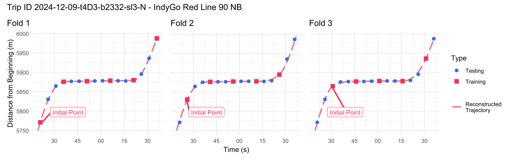
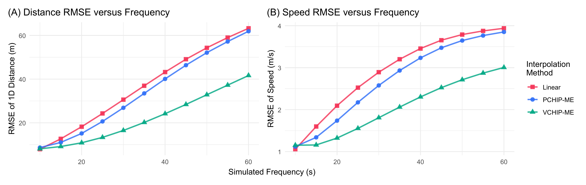
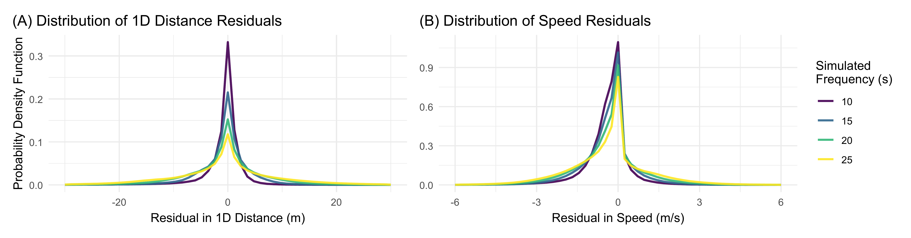
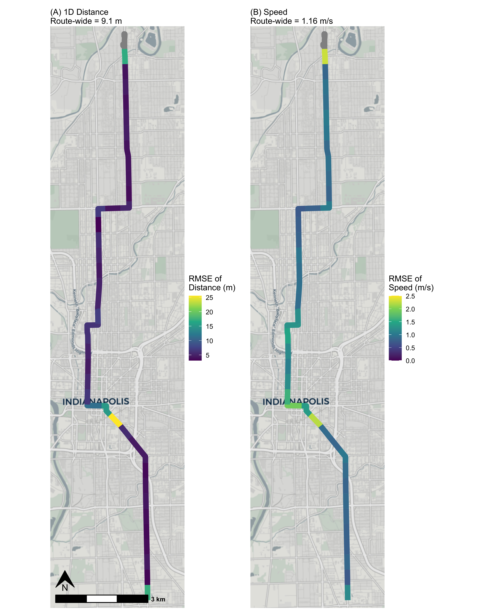

# Introduction

This vignette contains all code used to quantify and visualize the errors in trajectories reconstructed using `transittraj`, as presented and discussed in our Journal of Public Transportation paper. Our goals here are threefold: first, to give users a rough sense of the magnitude of error in reconstructed position and speed estimates; second, to evaluate the robustness of trajectories to low polling frequencies; and third, to evaluate how the different interpolation methods supported by `transittraj` compare. While we do not have permission to share the data used in this test, we welcome users to adapt the code the replicate this evaluation using their own data.

This vignette is intended to complement our paper. Check out the full paper for a more thorough discussion of this methodology.

# Data

Let's begin by loading the libraries we'll be using:


``` r
# Data
library(transittraj)
library(tidyverse)
#> Warning: package 'tidyverse' was built under R version 4.4.2
#> Warning: package 'ggplot2' was built under R version 4.4.3
#> Warning: package 'tidyr' was built under R version 4.4.3
#> Warning: package 'readr' was built under R version 4.4.2
#> Warning: package 'purrr' was built under R version 4.4.2
#> Warning: package 'dplyr' was built under R version 4.4.3
#> Warning: package 'stringr' was built under R version 4.4.3
#> Warning: package 'forcats' was built under R version 4.4.2
#> Warning: package 'lubridate' was built under R version 4.4.2
#> ── Attaching core tidyverse packages ──────────────────────────────────────────────── tidyverse 2.0.0 ──
#> ✔ dplyr     1.2.1     ✔ readr     2.1.5
#> ✔ forcats   1.0.0     ✔ stringr   1.6.0
#> ✔ ggplot2   4.0.3     ✔ tibble    3.2.1
#> ✔ lubridate 1.9.4     ✔ tidyr     1.3.2
#> ✔ purrr     1.0.2     
#> ── Conflicts ────────────────────────────────────────────────────────────────── tidyverse_conflicts() ──
#> ✖ dplyr::filter() masks stats::filter()
#> ✖ dplyr::lag()    masks stats::lag()
#> ℹ Use the conflicted package (<http://conflicted.r-lib.org/>) to force all conflicts to become errors

# Spatial
library(sf)
#> Linking to GEOS 3.13.0, GDAL 3.10.1, PROJ 9.5.1; sf_use_s2() is TRUE
library(stplanr)
#> Warning: package 'stplanr' was built under R version 4.4.3

# Plotting
library(ggspatial)
#> Warning: package 'ggspatial' was built under R version 4.4.3
library(patchwork)
#> Warning: package 'patchwork' was built under R version 4.4.3
library(marquee)
#> Warning: package 'marquee' was built under R version 4.4.3
```

We perform this robustness check on AVL data from IndyGo's northbound Red Line BRT service. We accessed IndyGo’s AVL data from their Swiftly endpoint, after which it was reformatted to meet the TIDES standards required by `transittraj` and stored in the dataframe `avl_df`. IndyGo’s buses had AVL polling frequencies ranging from 5 to 15 seconds; we kept only trips with 5-second polling frequencies for this study.


``` r
# Number of observations
paste(dim(avl_df)[1], " observations",
      sep = "")
#> [1] "1707095 observations"

# Number of trips
paste(length(unique(avl_df$trip_id_performed)), " trips",
      sep = "")
#> [1] "3256 trips"

# Time range
paste("Time range: ", as.POSIXct(min(avl_df$event_timestamp), tz = "America/New_York"),
      " - to - ", as.POSIXct(max(avl_df$event_timestamp), tz = "America/New_York"),
      sep = "")
#> [1] "Time range: 2024-11-01 00:00:01 - to - 2024-12-31 23:58:58"
```

The second piece of data required is the northbound Red Line's alignment. This was accessed through IndyGo's GTFS `shapes.txt` file, and is stored in the `sf` object `route_geom`.


``` r
print(route_geom)
#> Simple feature collection with 1 feature and 1 field
#> Geometry type: MULTILINESTRING
#> Dimension:     XY
#> Bounding box:  xmin: 571795.1 ymin: 4395912 xmax: 573767.5 ymax: 4414347
#> Projected CRS: WGS 84 / UTM zone 16N
#> # A tibble: 1 × 2
#>   shape_id                                                                              geometry
#>   <chr>                                                                    <MULTILINESTRING [m]>
#> 1 12057_shp ((573767.5 4395912, 573767 4395940, 573766.6 4395966, 573764.6 4396102, 573764.1 ...
```

# Methods

## Cross-Validation Approach

Using a dataset with 5-second AVL pings, we evaluate the proposed workflow on 10-, 15-, 20-, 25-, 30-, and 45-second simulated polling frequencies $f_\text{sim}$. For each simulated frequency, we select a training dataset by keeping every $f_\text{sim} / 5$ points. All remaining points are used as the testing dataset. This is repeated $f_\text{sim} / 5$ times, shifting the training dataset by one point each time. An example for $f_\text{sim} = 15$ seconds, with $15 / 5 = 3$ folds, is shown in the figure below.



For each CV fold, we apply the same cleaning methodology discussed in the the AVL cleaning vignette. To understand the relative performance of the different trajectory reconstruction methods, we then apply three separate interpolation methods: first, the recommended VCHIP-ME cubic splines; second, PCHIP-ME, cubic splines with monotonic enforcement but without observed bus speeds; and third, simple linear interpolation without monotonic enforcement and without knowledge of observed bus speeds.

Once each trajectory was fit to the training dataset, we calculate three error terms relative to the raw testing dataset: first, the distance along the route between each test point and the fit trajectory (1D distance); second, the distance through space between each test point and the fit trajectory's location on the route alignment (2D distance); and third, the difference in speed between each test point and the trajectory. We then calculate the root mean square error (RMSE) of each of each error type across all folds of each trajectory type and simulated frequency. Finally, to identify spatial patterns in error, we group point errors into 500-meter segments along the route, and calculate the RMSE within each zone.

## Initial Cleaning & Filtering

Throughout this robustness check, we aim to exclude points which are off-route, in an overlapped sub-trips, or a trip tail. We also only wish to keep trips with sufficient data and with a 5-second polling frequency. To identify the appropriate points & trips, we'll apply the cleaning methodology from `vignette("articles/jpt-cleaning")` through step 6:


``` r
# Step 1/2
s1 <- get_linear_distances(avl_df = avl_df,
                           shape_geometry = route_geom,
                           clip_buffer = 50,
                           project_crs = 32616) %>%
  filter(distance < 20500)

# Step 3
s3 <- clean_overlapping_subtrips(distance_df = s1,
                                 check_operator = TRUE,
                                 remove_single_observations = TRUE) %>%
  mutate(location_ping_id = as.character(location_ping_id))

# Step 4
s4 <- clean_jumps(distance_df = s3)
s4_remov <- clean_jumps(distance_df = s3,
                        return_removals = TRUE) %>%
  pull(location_ping_id)

# Step 5
s5 <- trim_trips(distance_df = s4)
#> Warning: Trips found with maximum at or before minimum point -- potential wrong direction.
#> Removing the following: 2024-11-22-t325-b2331-sl3-N, 2024-11-25-t803-b2335-sl3-N, 2024-12-05-t60E-b2334-sl3-N, 2024-12-12-t84D-b233C-sl3-N, 2024-12-31-t5-b233D-sl3-N

# Step 6
s6 <- clean_incomplete_trips(distance_df = s5,
                             min_trip_distance = 500,
                             min_trip_duration = 90,
                             max_distance_gap = 800)
```

Now we can find the list of pings (identified by their `location_ping_id`) and trips (identified by their unique `trip_id_performed`) to keep in the initial cross-validation dataset. We will keep pings not off-route, not in a trip tail, and not in an overlapped subtrip. We will retain outliers, as these will be identified in each fold of the cross-validation process.


``` r
keep_pings <- c(s6$location_ping_id,
                s4_remov)
```

Next, we'll find the trips we want to keep. After filtering the dataset to the pings we're keeping, we'll retain trips with at least one remaining observations and a polling frequency below 7 seconds (corresponding to an average polling frequency of 5 seconds, with random gaps).


``` r
avl_summ <- avl_df %>%
  filter(location_ping_id %in% keep_pings) %>%
  group_by(trip_id_performed) %>%
  summarize(t_min = min(event_timestamp),
            t_max = max(event_timestamp),
            t = as.numeric(t_max) - as.numeric(t_min),
            n_obs = n(),
            freq = t / n_obs)
keep_trips <- avl_summ %>%
  filter((n_obs > 1) & (freq < 7)) %>%
  pull(trip_id_performed)

paste(length(keep_trips), " trips",
      sep = "")
#> [1] "1162 trips"
```

In total, the CV robustness check will evaluate 1,162 trips. Using the trips and points we wish to retain, we'll finalize our cleaned, initial dataset.


``` r
base_df <- s3 %>%
  filter((trip_id_performed %in% keep_trips) &
           (location_ping_id %in% keep_pings)) %>%
  select(event_timestamp, trip_id_performed, distance, speed, location_ping_id)

base_sf <- avl_df %>%
  filter((trip_id_performed %in% keep_trips) &
           (location_ping_id %in% keep_pings)) %>%
  st_as_sf(coords = c("longitude", "latitude"),
           crs = 4326) %>%
  st_transform(crs = 32616) %>%
  select(trip_id_performed, event_timestamp, location_ping_id)
```

## Implementation

With our base dataset, we can perform the cross-validation. We'll define three primary functions to perform the process:

  * A fold function `cv_fold()`, to create a testing and training dataset;
  
  * A cleaning function `clean_avl()`, to implement the data cleaning workflow on the training dataset;
  
  * And an error calculation function `traj_err()`, to calculate the three residual terms (1D distance, 2D distance, and speed) between the testing dataset and fit trajectories.
  
Below we begin by defining the folding function. Given the raw dataset's 5-second frequency, this takes in a simulated frequency (`test_freq`) and iteration number (`offset`), returning a list containing the testing and training dataset at that frequency and offset.


``` r
base_freq <- 5 # avg ping frequency

cv_fold <- function(test_freq, offset) {
  keep_mod <- test_freq / base_freq

  train_df <- base_df %>%
    group_by(trip_id_performed) %>%
    mutate(row = row_number() + offset) %>%
    filter((row %% keep_mod) == 0) %>%
    ungroup()
  test_df <- base_df %>%
    filter(!(location_ping_id %in% train_df$location_ping_id))

  return(list(train_df,
              test_df))
}
```

Next we define our cleaning process. This implements the workflow through step 6 (removing insufficient trips) on the training data. Step 7 (monotonic enforcement) will be performed in the loop later.


``` r
clean_avl <- function(train_df) {

  # Step 4
  s4 <- clean_jumps(distance_df = train_df)

  # Step 5
  s5 <- trim_trips(distance_df = s4)

  # Step 6
  s6 <- clean_incomplete_trips(distance_df = s5,
                               min_trip_distance = 500,
                               min_trip_duration = 90,
                               max_distance_gap = 800)

  return(s6)
}
```

Finally, we'll define a function to calculate our residuals. This one is a bit more complicated. We begin by using the the `predict()` method on the input trajectory to find the trajectory's value at the testing dataset's timestamps. For differentiable trajectories (in which `deriv = c(0, 1)`), the speed calculation is simple; for the linear trajectory, we use the cleaned training dataset (`fit_df`) to estimate the speed by finding the slope between the nearest leading and lagging training points on either side of each testing point. Once this is complete, 1D and speed residuals are the simple difference between the calculated and observed values; for 2D residuals, we can use `sf` spatial functions to find the route's latitude-longitude location at that timestamp, then compare this to the raw latitude-longitude ping.


``` r
# Find current trajectory's deviation from base data
traj_err <- function(traj, test_df, test_freq, offset, deriv, fit_df = NULL) {

  # Get calculated traj
  # also filters test data to only those between observed train data points
  calc_df <- predict(object = traj,
                     new_times = (test_df %>%
                       select(event_timestamp, trip_id_performed, location_ping_id)),
                     deriv = deriv)

  if (1 %in% deriv) {
    pivot_df <- calc_df %>%
      pivot_wider(id_cols = c("location_ping_id"),
                  names_from = "deriv", names_glue = "interp_{.name}",
                  values_from = "interp") %>%
      rename(traj_dist = interp_0,
             traj_speed = interp_1)
  } else {
    # if linear interpolation, calculate speeds using surrounding fit points
    speed_calc <- bind_rows(
      # get cleaned training data
      fit_df %>%
        select(-row) %>%
        mutate(event_timestamp = as.numeric(event_timestamp)) %>%
        arrange(trip_id_performed, event_timestamp) %>%
        group_by(trip_id_performed) %>%
        # calculate linear slope between all training points
        mutate(lin_speed_forward = (lead(distance) - distance) / (lead(event_timestamp) - event_timestamp),
               type = "train") %>%
        ungroup(),
      # get testing points
      calc_df %>%
        rename(distance = interp) %>%
        mutate(speed = NA,
               lin_speed_forward = NA,
               type = "test") %>%
        select(-deriv)
    ) %>%
      arrange(trip_id_performed, event_timestamp) %>%
      group_by(trip_id_performed) %>%
      # carry forward slope from training points to next testing points
      mutate(lin_speed_forward = zoo::na.locf(lin_speed_forward)) %>%
      ungroup() %>%
      filter(type == "test") %>%
      mutate(traj_speed = lin_speed_forward) %>%
      select(location_ping_id, traj_speed)

    pivot_df <- calc_df %>%
      pivot_wider(id_cols = c("location_ping_id"),
                  names_from = "deriv", names_glue = "interp_{.name}",
                  values_from = "interp") %>%
      left_join(y = speed_calc, by = "location_ping_id") %>%
      rename(traj_dist = interp_0)
  }

  # Keep only pings in range of reconstructed traj
  obs_df <- base_df %>%
    filter(location_ping_id %in% pivot_df$location_ping_id)
  obs_sf <- base_sf %>%
    filter(location_ping_id %in% pivot_df$location_ping_id)

  # Linear (1D) residuals
  res_1D_df <- obs_df %>%
    left_join(pivot_df, by = "location_ping_id") %>%
    mutate(res_dist_1D = distance - traj_dist,
           res_speed = speed - traj_speed) %>%
    filter(!(is.na(res_dist_1D)) &
             !(is.na(res_speed)))

  # Spatial (2D) residuals
  if (!all(obs_sf$location_ping_id == pivot_df$location_ping_id)) {
    rlang::abort("mis-matched SF and DF rows")
  }
  calc_sf <- st_line_interpolate(line = (route_geom %>% st_as_sfc()),
                                 dist = pivot_df$traj_dist)
  res_2D_df <- st_distance(obs_sf,
                           calc_sf,
                           by_element = TRUE)

  # Final DF
  res <- res_1D_df %>%
    mutate(res_dist_2D = res_2D_df,
           freq = test_freq,
           off = offset)
  return(res)
}
```

Those three functions are the bulk of the work we need. We'll set up a nested for loop to cycle through each simulated frequency, then within each offset in that frequency. Within each offset, we use `cv_fold()` to retrieve the testing and training datasets, then `clean_avl()` to retrieve the cleaned dataset through step 7. We'll use the base workflow function `make_monotonic()` to make the dataset monotonic, then fit the three trajectories. Finally, we use `traj_err()` to find the residuals along each trajectory and store the results in a list.


``` r
# primary round: c(10, 15, 20, 25, 30, 45). for main results table.
# secondary round: c(35, 40, 50, 55, 60). to include in scaling figure.
test_freqs <- c(35, 40, 50, 55, 60)
res_list <- list()

for (freq in test_freqs) {
  print(paste("Current freq: ", freq, " s",
              sep = ""))

  offsets <- 0:((freq / base_freq) - 1)

  for (off in offsets) {
    print(paste("Current offset: ", off + 1, " of ", max(offsets) + 1,
                sep = ""))

    # Pull data
    current_fold <- cv_fold(test_freq = freq,
                              offset = off)
    train_df <- current_fold[[1]]
    test_df <- current_fold[[2]]

    # AVL cleaning
    current_df <- clean_avl(train_df = train_df)
    mono_df <- make_monotonic(distance_df = current_df,
                                    correct_speed = TRUE,
                                    add_distance_error = 0.001)

    # Trajectory fitting
    vchip_traj <- get_trajectory_fun(distance_df = mono_df)
    pchip_traj <- get_trajectory_fun(distance_df = mono_df,
                                     use_speeds = FALSE)
    lin_traj <- suppressWarnings(
      get_trajectory_fun(distance_df = current_df,
                         interp_method = "linear",
                         use_speeds = FALSE,
                         find_inverse_function = FALSE)
    )

    # Error residuals
    vchip_res <- traj_err(traj = vchip_traj,
                            test_df = test_df,
                            test_freq = freq,
                            offset = off,
                            deriv = c(0, 1))
    pchip_res <- traj_err(traj = pchip_traj,
                          test_df = test_df,
                          test_freq = freq,
                          offset = off,
                          deriv = c(0, 1))
    lin_res <- traj_err(traj = lin_traj,
                        test_df = test_df,
                        test_freq = freq,
                        offset = off,
                        deriv = c(0),
                        fit_df = current_df)
    current_res <- rbind(
      vchip_res %>% mutate(method = "VCHIP"),
      pchip_res %>% mutate(method = "PCHIP"),
      lin_res %>% mutate(method = "Linear")
    )

    res_list[[paste(freq, off, sep = "-")]] <- current_res
  }
}

res <- bind_rows(res_list)
units(res$res_dist_2D) <- NULL
```


We can now create some summary tables.


``` r
# Base summary
summ <- res %>%
  mutate(SE_dist_1D = res_dist_1D^2,
         SE_dist_2D = res_dist_2D^2,
         SE_speed = res_speed^2) %>%
  group_by(method, freq) %>%
  summarize(mean_1D_error = mean(res_dist_1D),
            mean_speed_error = mean(res_speed),
            n_test_obs = n(),
            trips = length(unique(trip_id_performed)),
            SSE_dist_1D = sum(SE_dist_1D),
            SSE_dist_2D = sum(SE_dist_2D),
            SSE_speed = sum(SE_speed),
            SD_dist_1D = sd(res_dist_1D),
            SD_dist_2D = sd(res_dist_2D),
            SD_speed = sd(speed),
            .groups = "keep") %>%
  ungroup() %>%
  mutate(MSE_dist_1D = SSE_dist_1D / n_test_obs,
         MSE_dist_2D = SSE_dist_2D / n_test_obs,
         MSE_speed = SSE_speed / n_test_obs,
         RMSE_dist_1D = sqrt(MSE_dist_1D),
         RMSE_dist_2D = sqrt(MSE_dist_2D),
         RMSE_speed = sqrt(MSE_speed),
         method = case_when(
           method == "VCHIP" ~ "VCHIP-ME",
           method == "PCHIP" ~ "PCHIP-ME",
           method == "Linear" ~ "Linear"
         ))

# Cleaned summary
summ_clean <- summ %>%
  mutate(rmse_1d = sprintf(RMSE_dist_1D, fmt = "%.2f"),
         rmse_2d = sprintf(RMSE_dist_2D, fmt = "%.2f"),
         rmse_speed = sprintf(RMSE_speed, fmt = "%.2f")) %>%
  select(freq, method, trips,
         rmse_1d, rmse_speed,
         ) %>%
  arrange(freq, method) %>%
  filter((freq > 5) & (freq <= 30)) %>%
  rename(`RMSE of 1D Distance (m)` = rmse_1d,
         `RMSE of Speed (m/s)` = rmse_speed,
         `Simulated Frequency (sec)` = freq,
         `Method` = method,
         `Number of Trips` = trips)
```

Next, we'll plot the distance and speed RMSEs against polling frequencies to visualize how they scale:


``` r
my_r <- "#f43155"
my_b <- "#2f6ff8"
my_g <- "#00A884"

ref <- data.frame(freq = c(10, 45, 60)) %>%
  mutate(RMSE_dist_1D = 1 * freq,
         RMSE_speed = 0.1 * freq)

# - Distance -
dist_scale_plot <- ggplot(data = summ %>% filter(freq > 5)) +
  # geom_line(data = ref,
  #           aes(x = freq, y = RMSE_dist_1D, linetype = "Linear\nRelationship"),
  #           color = "grey40",
  #           linewidth = 0.7, alpha = 0.7) +
  geom_line(aes(x = freq, y = RMSE_dist_1D, color = method),
            linewidth = 0.9, alpha = 0.8) +
  geom_point(aes(x = freq, y = RMSE_dist_1D,
                 color = method, shape = method),
             size = 2.5, alpha = 0.9) +
  scale_color_manual(name = "Interpolation\nMethod",
                     values = c("Linear" = my_r,
                                "PCHIP-ME" = my_b,
                                "VCHIP-ME" = my_g)) +
  scale_shape_manual(name = "Interpolation\nMethod",
                     values = c("Linear" = 15,
                                "PCHIP-ME" = 16,
                                "VCHIP-ME" = 17)) +
  # scale_linetype_manual(name = "Reference\nLine",
  #                       values = c("Linear\nRelationship" = "dashed")) +
  # scale_x_log10() +
  # scale_y_log10() +
  theme_minimal() +
  theme(plot.title.position = "plot") +
  labs(y = "RMSE of 1D Distance (m)",
       x = "Simulated Frequency (s)",
       title = "(A) Distance RMSE versus Frequency")

# - Speed -
speed_scale_plot <- ggplot(data = summ %>% filter(freq > 5)) +
  # geom_line(data = ref,
  #           aes(x = freq, y = RMSE_speed, linetype = "Linear\nRelationship"),
  #           color = "grey40",
  #           linewidth = 0.7, alpha = 0.7) +
  geom_line(aes(x = freq, y = RMSE_speed, color = method),
            linewidth = 0.9, alpha = 0.8) +
  geom_point(aes(x = freq, y = RMSE_speed,
                 color = method, shape = method),
             size = 2.5, alpha = 0.9) +
  scale_color_manual(name = "Interpolation\nMethod",
                     values = c("Linear" = my_r,
                                "PCHIP-ME" = my_b,
                                "VCHIP-ME" = my_g)) +
  scale_shape_manual(name = "Interpolation\nMethod",
                     values = c("Linear" = 15,
                                "PCHIP-ME" = 16,
                                "VCHIP-ME" = 17)) +
  # scale_linetype_manual(name = "Reference\nLine",
  #                       values = c("Linear\nRelationship" = "dashed")) +
  # scale_x_log10() +
  # scale_y_log10(limits = c(1, 4.5)) +
  theme_minimal() +
  theme(plot.title.position = "plot") +
  labs(y = "RMSE of Speed (m/s)",
       x = "Simulated Frequency (s)",
       title = "(B) Speed RMSE versus Frequency")

# - Combine -
combo_scale <- dist_scale_plot + speed_scale_plot +
  plot_layout(ncol = 2, nrow = 1,
              guides = "collect", axis_titles = "collect")
```


Finally, to visualize how these RMSEs change with the polling frequency, and if any bias is present in our estimates, we'll plot the distribution of residuals. Because our focus is on VCHIP-ME, we'll filter the dataset to only this method.


``` r
plot_freq <- c(10, 15, 20, 25)
plot_method <- c("VCHIP")
bins <- 51

# Histogram of 1D distance
dist_hist <- ggplot(data = (res %>%
                              filter(method %in% plot_method) %>%
                              filter(freq %in% plot_freq) %>%
                              mutate(freq = as.factor(freq)))) +
  geom_freqpoly(aes(x = res_dist_1D, y = after_stat(density),
                     color = freq, group = freq),
                 bins = bins, alpha = 0.9, linewidth = 0.9) +
  scale_color_viridis_d(name = "Simulated\nFrequency (s)") +
  xlim(c(-30, 30)) +
  theme_minimal() +
  labs(x = "Residual in 1D Distance (m)",
       y = "Probability Density Function",
       title = "(A) Distribution of Distance Residuals") +
  theme(plot.title = element_marquee(),
        plot.title.position = "plot")

# Histogram of speeds
speed_hist <- ggplot(data = (res %>%
                              filter(method %in% plot_method) %>%
                              filter(freq %in% plot_freq) %>%
                              mutate(freq = as.factor(freq)))) +
  geom_freqpoly(aes(x = res_speed, y = after_stat(density), group = freq,
                     color = freq),
                 bins = bins, alpha = 0.9, linewidth = 0.9) +
  scale_color_viridis_d(name = "Simulated\nFrequency (s)") +
  xlim(c(-6, 6)) +
  theme_minimal() +
  labs(x = "Residual in Speed (m/s)",
       y = NULL,
       title = "(B) Distribution of Speed Residuals") +
  theme(plot.title = element_marquee(),
        plot.title.position = "plot")

combo_hist <- dist_hist + speed_hist +
  plot_layout(guides = "collect")
```


## Spatial Pooling

The final component is to pool residuals along the route to identify spatial patterns. We'll begin by defining our pool cutoffs in 500-meter segments:


``` r
pool_width <- 500 # meters
pools <- data.frame(
  init_dist = seq(from = 0, to = 20500 - pool_width, by = pool_width)
) %>%
  mutate(final_dist = init_dist + pool_width,
         pool_id = row_number())
```

We can then join these cutoffs with the raw results, then creat our pooled summary statistics. Our focus will be on the primary recommended trajectory reconstruction method, VCHIP-ME, so we'll filter our results to include that VCHIP-ME residuals only.


``` r
pooled_summ <- res %>%
  filter(method == "VCHIP") %>%
  select(-method) %>%
  left_join(y = pools,
            by = join_by(distance < final_dist, distance >= init_dist)) %>%
  select(-c(init_dist, final_dist)) %>%
  mutate(SE_dist_1D = res_dist_1D^2,
         SE_dist_2D = res_dist_2D^2,
         SE_speed = res_speed^2) %>%
  group_by(freq, pool_id) %>%
  summarize(obs = n(),
            SSE_dist_1D = sum(SE_dist_1D),
            SSE_dist_2D = sum(SE_dist_2D),
            SSE_speed = sum(SE_speed),
            .groups = "keep") %>%
  mutate(MSE_dist_1D = SSE_dist_1D / obs,
         MSE_dist_2D = SSE_dist_2D / obs,
         MSE_speed = SSE_speed / obs,
         RMSE_dist_1D = sqrt(MSE_dist_1D),
         RMSE_dist_2D = sqrt(MSE_dist_2D),
         RMSE_speed = sqrt(MSE_speed))

pooled_summ_summ <- pooled_summ %>%
  group_by(freq) %>%
  summarize(num_1D_lt3 = sum(RMSE_dist_1D < 3),
            num_1D_lt5 = sum(RMSE_dist_1D < 5),
            num_2D_lt3 = sum(RMSE_dist_2D < 3),
            num_2D_lt5 = sum(RMSE_dist_2D < 5),
            num_speed_lt1 = sum(RMSE_speed < 1)) %>%
  mutate(per_1D_lt3 = num_1D_lt3 / (length(pools$pool_id) - 2),
         per_1D_lt5 = num_1D_lt5 / (length(pools$pool_id) - 2),
         per_2D_lt3 = num_2D_lt3 / (length(pools$pool_id) - 2),
         per_2D_lt5 = num_2D_lt5 / (length(pools$pool_id) - 2),
         per_speed_lt1 = num_speed_lt1 / (length(pools$pool_id) - 2))
```

Finally, we'll once again generate a plot of these spatial pools. We'll focus our plot on VCHIP-ME at 15-second frequencies.


``` r
plot_freq <- 15

# Set up route spatial features
route_segs <- line_segment(route_geom %>% st_cast("LINESTRING"),
                           segment_length = pool_width) %>%
  mutate(pool_id = row_number())
segs_join <- route_segs %>%
  left_join(y = pooled_summ %>% filter(freq == plot_freq),
            by = "pool_id")

# Labeling
lab_vec <- c(round(summ %>% filter(freq == plot_freq) %>% pull(RMSE_dist_1D), 1),
             round(summ %>% filter(freq == plot_freq) %>% pull(RMSE_dist_2D), 1),
             round(summ %>% filter(freq == plot_freq) %>% pull(RMSE_speed), 2))

# Plot bounding box
segs_bbox <- st_bbox(route_segs)
s <- 8 # plot spacing
d_x <- 1200 # m, x bbox expand
d_y <- 250 # m, y bbox expand
plot_bbox <- st_bbox(c(segs_bbox[1] - d_x,
                       segs_bbox[2] - d_y,
                       segs_bbox[3] + d_x,
                       segs_bbox[4] + d_y),
                     crs = 32616)

# 1D distances plot
map_1D <- ggplot() +
  annotation_map_tile(type = "cartolight",
                      zoomin = 0, progress = "none") +
  geom_sf(data = segs_join,
          aes(color = RMSE_dist_1D),
          linewidth = 3.5, alpha = 1) +
  annotation_north_arrow(which_north = "true",
                         location = "bl",
                         style = north_arrow_orienteering(fill = c("black", "black")),
                         height = unit(25, "pt"),
                         width = unit(25, "pt"),
                         pad_y = unit(25, "pt")) +
  annotation_scale(width_hint = 0.7,
                   location = "bl",
                   line_width = 1.5,
                   height = unit(10, "pt"),
                   text_face = "bold") +
  coord_sf(xlim = c(plot_bbox["xmin"], plot_bbox["xmax"]),
           ylim = c(plot_bbox["ymin"], plot_bbox["ymax"]),
           crs = 32616, expand = FALSE) +
  scale_color_viridis_c(name = "RMSE of\nDistance (m)") +
  theme_void() +
  theme(plot.margin = margin(0, s, 0, s, "pt")) +
  labs(subtitle = paste("(A) 1D Distance\nRoute-wide = ",
                        lab_vec[1], " m",
                        sep = ""))

# Speed plot
map_speed <- ggplot() +
  annotation_map_tile(type = "cartolight",
                      zoomin = 0, progress = "none") +
  geom_sf(data = segs_join,
          aes(color = RMSE_speed),
          linewidth = 3.5, alpha = 1) +
  coord_sf(xlim = c(plot_bbox["xmin"], plot_bbox["xmax"]),
           ylim = c(plot_bbox["ymin"], plot_bbox["ymax"]),
           crs = 32616, expand = FALSE) +
  scale_color_viridis_c(name = "RMSE of\nSpeed (m/s)",
                        limits = c(0, 2.5)) +
  theme_void() +
  theme(plot.margin = margin(0, s, 0, 1.5 * s, "pt")) +
  labs(subtitle = paste("(B) Speed\nRoute-wide = ",
                        lab_vec[3], " m/s",
                        sep = ""))

# Combine
combo_map <- map_1D + map_speed
```


## Sample Folds

Finally, we'll generate the visual above for the sample trajectory. To accomplish this, we'll filter the dataset to the desired trip, then run the same CV loop on that trip only.


# Results

## Residuals

Below we print our summary table. The RMSE is similar for all methods at the 10-second simulated frequency -- which removes ever other point in the dataset -- but that VCHIP-ME substantially outperforms linear and PCHIP-ME trajectories at worse frequencies. All three residual types follow this same pattern. What a "good" RMSE is will depend on the application, though for most performance analytics, the using VCHIP-ME on 20-second data will generally be reasonable; trajectories reconstructed from pings with more than 30-second frequencies will have large errors, even when using VCHIP-ME.


``` r
knitr::kable(summ_clean)
```


| Simulated Frequency (sec)|Method   | Number of Trips|RMSE of 1D Distance (m) |RMSE of Speed (m/s) |
|-------------------------:|:--------|---------------:|:-----------------------|:-------------------|
|                        10|Linear   |            1162|7.91                    |1.06                |
|                        10|PCHIP-ME |            1162|8.66                    |1.12                |
|                        10|VCHIP-ME |            1162|8.10                    |1.15                |
|                        15|Linear   |            1159|12.67                   |1.60                |
|                        15|PCHIP-ME |            1159|11.03                   |1.34                |
|                        15|VCHIP-ME |            1159|9.14                    |1.16                |
|                        20|Linear   |            1147|18.21                   |2.09                |
|                        20|PCHIP-ME |            1147|15.13                   |1.74                |
|                        20|VCHIP-ME |            1147|10.86                   |1.32                |
|                        25|Linear   |            1141|24.27                   |2.53                |
|                        25|PCHIP-ME |            1141|20.63                   |2.17                |
|                        25|VCHIP-ME |            1141|13.33                   |1.55                |
|                        30|Linear   |            1127|30.58                   |2.89                |
|                        30|PCHIP-ME |            1127|26.87                   |2.58                |
|                        30|VCHIP-ME |            1127|16.50                   |1.81                |


``` r
combo_scale
```



Below we display our residuals plots for 1D distances and speeds. We can see, as reflected in the RMSE values, the distribution of residuals widen as the frequency grows. For 1D distances, these residuals appear to be unbiased; they are symmetrically centered on 0. For speeds, however, there appears to be a slight negative bias. The reason for this is not exactly clear, though we would not necessarily expect the Fritsch-Carlson speed corrections to be unbiased. Regardless, the bias appears small, and the distribution is remains relatively tight, even as the frequency grows.


``` r
combo_hist
```



We'll note, once again, that these errors are relative to the raw, 5-second pings, *not* ground-truth bus locations. The recorded pings also reflect error in GPS readings.

## Spatial Pooling

Below we plot each spatial pool's RMSE. The map reveals that the spatial distribution of residuals is heterogenous, and high-error points are concentrated near downtown Indianapolis. Specifically, one segment along Virginia, immediately before downtown, runs underneath a large rail viaduct and parking garage (check it out here); this segment has an RMSE of 25.5 meters.


``` r
combo_map
```



Recognizing that the errors in reconstructed trajectories are concentrated along a few segments, we below show the portion of segments with low RMSEs. Nearly two-thirds of segments -- 64% -- have a 1D distance RMSE below 5 meters, and over two-thirds -- 69% -- have a speed RMSE below 1 m/s. This indicates that, in areas without urban canyons or covered roadways, the error between reconstructed trajectories and raw GPS points will be much smaller than the averages estimated above.


``` r
knitr::kable(pooled_summ_summ)
```


| freq| num_1D_lt3| num_1D_lt5| num_2D_lt3| num_2D_lt5| num_speed_lt1| per_1D_lt3| per_1D_lt5| per_2D_lt3| per_2D_lt5| per_speed_lt1|
|----:|----------:|----------:|----------:|----------:|-------------:|----------:|----------:|----------:|----------:|-------------:|
|    5|         24|         35|          1|         20|            30|  0.6153846|  0.8974359|   0.025641|  0.5128205|     0.7692308|
|   10|         24|         35|          1|         20|            30|  0.6153846|  0.8974359|   0.025641|  0.5128205|     0.7692308|
|   15|          0|         25|          0|          9|            27|  0.0000000|  0.6410256|   0.000000|  0.2307692|     0.6923077|
|   20|          0|          0|          0|          0|             3|  0.0000000|  0.0000000|   0.000000|  0.0000000|     0.0769231|
|   25|          0|          0|          0|          0|             1|  0.0000000|  0.0000000|   0.000000|  0.0000000|     0.0256410|
|   30|          0|          0|          0|          0|             0|  0.0000000|  0.0000000|   0.000000|  0.0000000|     0.0000000|
|   35|          0|          0|          0|          0|             0|  0.0000000|  0.0000000|   0.000000|  0.0000000|     0.0000000|
|   40|          0|          0|          0|          0|             0|  0.0000000|  0.0000000|   0.000000|  0.0000000|     0.0000000|
|   45|          0|          0|          0|          0|             0|  0.0000000|  0.0000000|   0.000000|  0.0000000|     0.0000000|
|   50|          0|          0|          0|          0|             0|  0.0000000|  0.0000000|   0.000000|  0.0000000|     0.0000000|
|   55|          0|          0|          0|          0|             0|  0.0000000|  0.0000000|   0.000000|  0.0000000|     0.0000000|
|   60|          0|          0|          0|          0|             0|  0.0000000|  0.0000000|   0.000000|  0.0000000|     0.0000000|


